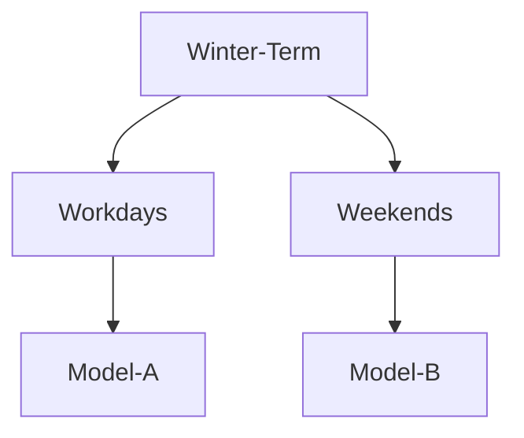
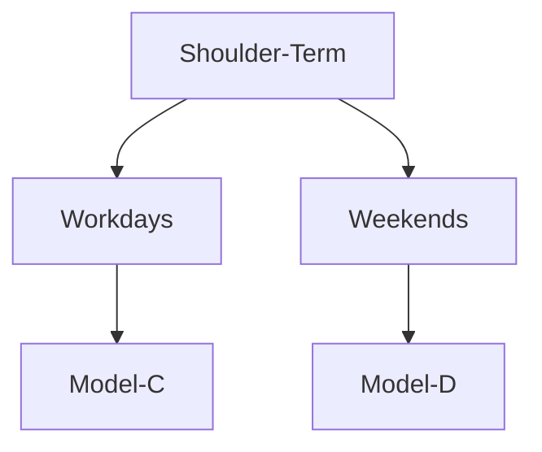

# Predictive Model for Heat Load in Buildings Connected to District Heating Network
# Project overview
District Heating (DH) systems operated reliably over decades and provided a relevant share of energy to households across Europe. Currently, 12% of Europe's heating energy to buildings is delivered by District Heating Networks (DHNs), with more than 6000 systems serving around 60 million citizens. Moreover the market shares for District Heating can be increased to 30% in 2030 and 50% in 2050 by introducing renewables and waste heat in the supply [1]. There are increasing variations in the system due to lower specific energy loads and intermittent renewable energy sources which raise the need for more accurate characterization and prediction of heat loads in buildings to ensure effective operation of these systems.

In this work we investigate the heat load patterns in one building using multi-step forecasting model based on **Segmented Auto Regressive Models (S-ARX-MLR)**. In other word we combine the Multivariate Linear Regression models (to capture physical dependencies) with Auto Regressive models (to deal with energy storage across data segments) and Integration features (to correct model inaccuracies), into an accurate and reliable regression model used in time series forecasting.
# Table of Contents
1. [Project Overview](#Project-Overview)
2. [Installation](#Installation)
3. [Data Sources](#Data-Sources)
4. [Data Preprocessing](#Data-Preprocessing)
5. [Load Assessment and Graphic Exploration](#Load-Assessment-and-Graphic-Exploration)
6. [Data Segmentation](#Data-Segmentation)
7. [Model Evaluation To characterize The Heat Load](#Model-Evaluation-To-characterize-The-Heat-Load)
8. [Model Optimization to Predict the Heat Load](#Model-Optimization-to-Predict-the-Heat-Load)
9. [Conclusion](#Conclusion)
# Installation
We clone the github repository in Google Colaboratory ([Google-Colab](https://colab.research.google.com)). A hosted jupyter notebook service that allow us to  write and execute arbitrary code through browser.  
## Step1 : 
Go to **File** ==> **Open Notebook** 

## Step2 : 
Paste the **URL of the github repository** you want to clone.

all the files will show. We can select the file that we want to work on 

# Data Sources
The sources of our data come from two locations: district heating substations and weather station.

The sub-network of the district heating covers 42 substations (buildings), located in Tartu (Estonia). The datasets were collected from each substation. We attached, in each building, an energy smart meter ([Kamstrup](https://www.kamstrup.com/en-en/heat-solutions/meters-devices)) that measures constantly different variables represented in heat load (kW), volumetric flow rate(m3/h), and five different supply and return temperatures(°C). The device sends the real time measured data to [GREN](https://gren.com/), the operator responsible for the district heating. 

Data taken from the [weather-station](https://meteo.physic.ut.ee/?lang=en), located in Tartu University (Estonia), have 15-minute frequency basis. The dataset related to the weather station comprise the outdoor temperature, wind speed(m/s), wind direction, irradiation flux(W/m2) and calendar data. 

# Data Preprocessing
The data preprocessing is an important step since it indicates whether we have a bad data resulted from experiment that may have not run-in proper way.

We go to Google Colab notebook, we select the file **Organized Data/Scripts/Outlier detection & repair.ipynb** 

This source code is composed of two sections: 
 * Data Preprocessing (before implementing the outlier detection and imputation process) : where we do few steps in order to combine the weather data and heat load data into a single dataset
* Implementing the outlier detection and imputation process : in this section we perform the identification of outliers along with the imputation process. (Imputation Process: where we fill  the heat load missing values after we remove the outliers). 

In the Github repository we go to **Organized data** ==> Select the folder **word files**==> choose the file **Outlier detection&repair.docx** 

This **word file** has a detailed explanation regarding the techniques used in applying the outlier detection and imputation process. Also it provides the outputs generated by the code.

# Load Assessment and Graphic Exploration

Plotting time series values for the selected building dataset allow to identify different patterns such as trends and seasonality. Moreover, it enables many features of the data. In particular, we can highlight the changes over time and recognize unusual observations.

We go to Google Colab notebook, we select the file **Organized Data/Scripts/Heat Load Assessment.ipynb** 

This source code is composed of two sections:

 * Load Assessment & Graphic exploration (Full year) : an initial analysis of the available dataset for the full year is performed with an identification of heat load patterns

 * Load Assessment & Graphic exploration (Winter term) : an initial analysis of the winter term dataset is performed with an identification of heat load patterns. (the winter term dataset is extracted from the available full year dataset)

In the Github repository we go to Organized data ==> Select the folder word files==> Heat load assessment&Graphic exploration.docx

In this word file we will find all the outputs and graphs regarding the load profile of the building along with a detail analysis of the heat load patterns.

# Data Segmentation

The data will be limited only to winter term (December to February) and shoulder season (March - May + Sep - Nov). The summer term will be excluded in this study to avoid the excessive relevance of period that have low heat load. Furthermore, the workdays and weekends were separated in order to remove the intraweek seasonality.

# Model Evaluation To characterize The Heat Load
In this part we explain the overall relationship between the predictors and the outcome variable, and at what settings the characterization of heat demand can deliver acceptable performance.

We go to Google Colab notebook, we select one of these two files: 

  :thong_sandal: **Organized Data/Scripts/Model Evaluation To characterize The Heat Load_winter.ipynb** : This file is dedicated for the models of the winter term. 
  
  :thong_sandal: **Organized Data/Scripts/Model Evaluation To characterize The Heat Load_shoulder** : This file is dedicated for the models of the shoulder term. 
  
  For both two files the source code is composed of the following sections : 

* Pre Modelling Step : We perform a few steps to create and organize the dataframe to be used in the modelling process. 
* Modelling Step (ARX Model) : We fit our model used **the Ordinary Least Square (OLS)** and apply the feature selection with variance thresholding to  extract the significant parameters.
* Model Quality ==> Graphical Residual Analysis: Several plots were represented to check if our assumption were reasonable and whether the choice of our model were appropriate or not.
